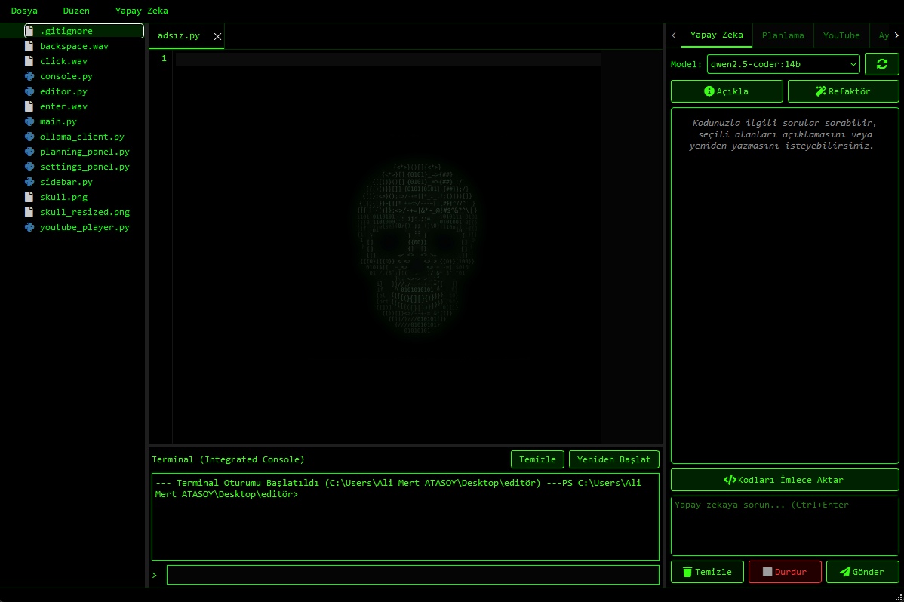

# Offline Agent IDE 🖥️🟢

**Offline Agent IDE**, yapay zeka ajan yetenekleriyle donatılmış, yerel LLM (Ollama) entegrasyonuna sahip, Matrix/Hacker estetiğine sahip modern bir kod editörüdür. Kod yazarken retro mekanik klavye sesleri, YouTube entegrasyonu ve görsel akış şemalarıyla planlama yapabilen yapay zeka ajanı gibi premium özellikler sunar.



## 🌟 Öne Çıkan Özellikler

*   **🟢 Neon Yeşil & Pitch Black Tema:** Gözleri yormayan, monospace yazı tipleriyle donatılmış modern Matrix hacker arayüzü.
*   **🔊 Mekanik Klavye & Daktilo Ses Efektleri:** Kod yazarken retro daktilo veya mekanik klavye sesleri üretir (Ayarlar kısmından açılıp kapatılabilir ve ses seviyesi ayarlanabilir).
*   **🧠 Akıllı Ajan Planlama (Visual Flowchart):** Yapay zeka karmaşık işler için adım adım planlar önerir, bu planlar neon parlayan bir akış şeması (flowchart) olarak çizilir ve onayınızın ardından otonom olarak yürütülür.
*   **🤖 Sesli Asistan (Text-to-Speech):** Planlama adımları, başarı ve hata durumları Türkçe sesli asistan tarafından seslendirilir.
*   **📂 Dosya ve Klasör Gezgini:** `.git`, `node_modules` gibi ağır kütüphaneleri otomatik gizleyen akıllı filtreleme motoruna sahip dosya gezgini.
*   **📺 Gömülü YouTube & YouTube Music Oynatıcısı:** Kod yazarken müzik dinlemeniz için Matrix temalı hızlı aramaya sahip gömülü tarayıcı.
*   **⚡ Performans Optimizasyonları:**
    *   **Linter Debouncing:** Yazarken işlemciyi yormayan geciktirmeli sözdizimi denetimi.
    *   **Smart Code Chunking:** Büyük dosyalarda sadece imleç etrafındaki 100 satırı yapay zekaya göndererek token sınırlarını aşmasını önler.
    *   **Render Buffering:** Yapay zeka sohbet akışını 25 FPS hızında pürüzsüzce çizer.

## 🛠️ Kurulum ve Çalıştırma

### Gereksinimler
*   Python 3.10+
*   [Ollama](https://ollama.com/) (Lokalde yapay zeka modelini çalıştırmak için)

### Kütüphane Kurulumları
Gerekli Python paketlerini yükleyin:
```powershell
pip install PyQt6 PyQt6-WebEngine qtawesome ollama
```

### Editörü Başlatma
Ollama uygulamasını başlattığınızdan emin olduktan sonra editörü çalıştırın:
```powershell
python main.py
```

## 📜 Lisans
Bu proje MIT lisansı altında lisanslanmıştır.
